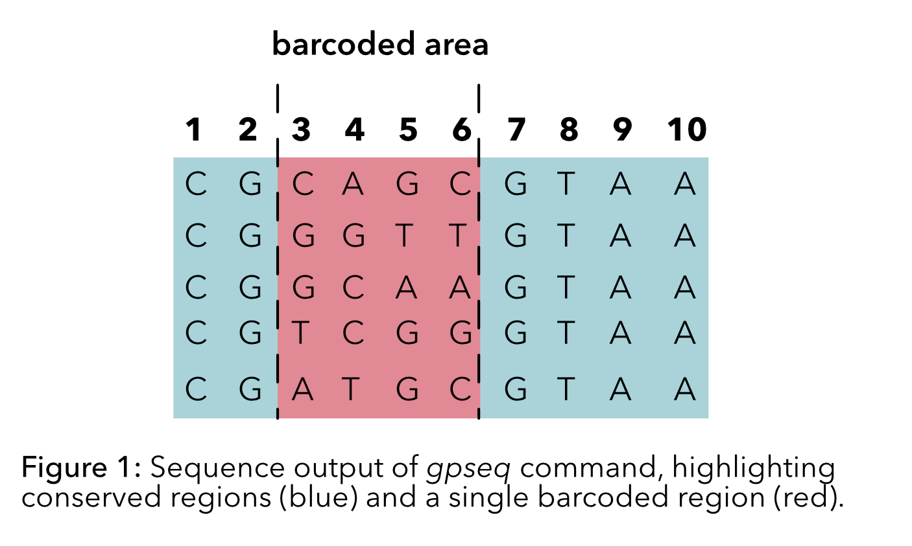
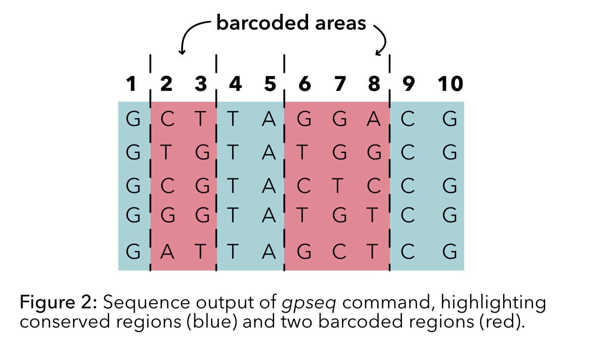
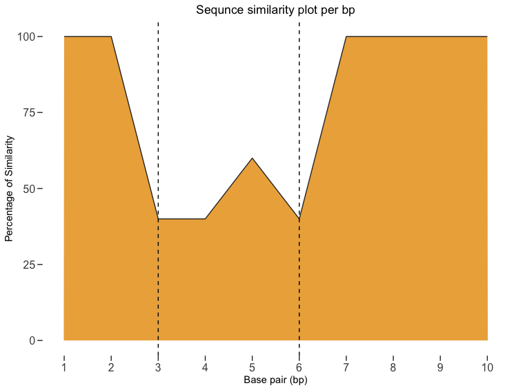
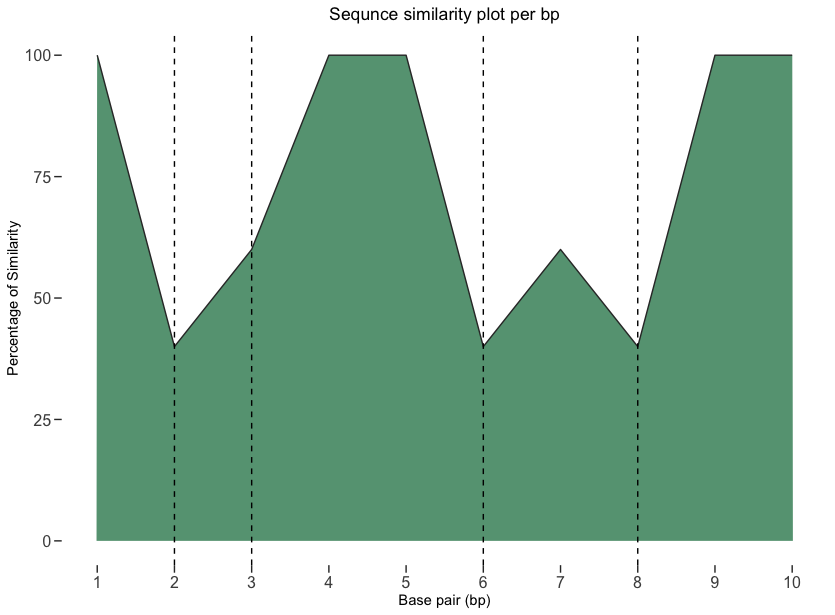

[](https://www.tidyverse.org/lifecycle/#experimental)
[](https://cran.r-project.org/package=icons)
[](https://opensource.org/licenses/MIT)

## Install the BarcoSim package
Install the package using the following commands  

```r
# for now you can install the developemental version of ltc
# first you need to install the devtools package 
# in case you have not already installed
install.packages("devtools") 
# and load it
library(devtools)

# then you can install the dev version of the ltc
devtools::install_github("loukesio/BarcoSim")
# and load it
library(BarcoSim)
```

### 1. Use the `gpseq` command to generate the parent sequences.
 Parameters:
- `num_sequences`: An integer specifying the number of DNA sequences to generate.

- `seq_length`: An integer representing the length of each DNA sequence.

- `range_start`: An integer indicating the start position of the barcoded sequence.

- `range_end`: An integer indicating the end position of the barcoded sequence.


``` r
library(Biostrings) # Provides tools for working with biological sequences, such as DNA, RNA, and protein sequences
library(BarcoSim)   # BarcoSim: A package for simulating barcoded sequencing data
library(dplyr)      # A powerful package for data manipulation and transformation,


set.seed(123)       # sets the random seed to ensure the reproducibility of a random processes (generation of sequences)

# This function creates 5 parent sequences, each with 10 base pairs and a single barcode area spanning from base 3 to base 6.
df1.1 <- gpseq(num_sequences=5, seq_length=10, range_start=3, range_end=6)

df1.1 %>% 
  DNAStringSet()
  
#> DNAStringSet object of length 10:
#>      width seq
#> [1]    10 CGCAGCGTAA
#> [2]    10 CGTGTTGTAA
#> [3]    10 CGGCAAGTAA
#> [4]    10 CGTCGGGTAA
#> [5]    10 CGATGCGTAA

# Create five parent sequences, each consisting of 10 base pairs, with multiple barcoded regions spanning from base 2 to base 3 and 
# from base 6 to base 8.
df1.2 <- gpseq(5,10,range_start=c(2,6), range_end=c(3,8))

df1.2 %>% 
DNAStringSet()

DNAStringSet object of length 5:
    width seq
[1]    10 GCTTAGGACG
[2]    10 GTGTATGGCG
[3]    10 GCGTACTCCG
[4]    10 GGGTATGTCG
[5]    10 GATTAGCTCG

```
<sup>Created on 2023-04-15 with [reprex v2.0.2](https://reprex.tidyverse.org)</sup>

The outcome of the gpseq contains the conserved sequences from 1-2 and 7-10, and the barcode sequences from 3-6 (see Figure1). In addition with the help of the function `calcSeqSim` we can quantify the similarity among sequences at each base pair.

<p float="left">
  
  
</p>

### 2. Use the `calcSeqSim` function to plot sequence similarity across the parent sequences
parameters: 
- `dna_seq`: A character vector of DNA sequences obtained as the output of the `gpseq` function.

Plotting sequence similarity in a sequence with a single barcoded area:
``` r
library(BarcoSim)
library(ggplot2)
library(dplyr)

df1.1 = c("CGCAGCGTAA", "CGTGTTGTAA", "CGGCAAGTAA", "CGTCGGGTAA", "CGATGCGTAA")
df1.1
#> [1] "CGCAGCGTAA" "CGTGTTGTAA" "CGGCAAGTAA" "CGTCGGGTAA" "CGATGCGTAA"

#______________________________________________
# Find sequence similarity at each position
#______________________________________________
calSeqSim(df1.1)
#> [1] 100 100  40  40  60  40 100 100 100 100

#___________________________
# plotting example :)
#____________________________
# Create the tibble
df1.1_data <- calSeqSim(df1.1)  %>% 
  tibble() %>% 
  dplyr::rename(similarity=1)

# Create the geom area plot
ggplot(df1.1_data, aes(x = 1:nrow(df1.1_data), y = similarity, fill = similarity)) +
  geom_area(color = "#333333", fill = "#edae49") +
  xlab("Base pair (bp)") +
  ylab("Percentage of Similarity") +
  ggtitle("Sequnce similarity plot per bp") +
  scale_x_continuous(breaks=seq(1:10)) +
  theme(panel.grid = element_blank(),
        panel.background = element_rect(fill = "white"), 
        plot.title = element_text(hjust=0.5), 
        axis.text = element_text(size=12), 
        axis.ticks.length = unit(.2, "cm")) +
  geom_vline(xintercept =c(3,6), linetype="dashed")

# similarly you can plot the df1.2 data
  
```
<p float="left">
  
  
</p>


### 3. Use the `r_gpseq` command to replicate parent sequences and make a barcode data set. 
 Parameters:

- `dna_seq`: A character vector of DNA sequences, obtained as the output of the `gpseq` function.

- `num_replicates`: An integer specifying the number of times each parent sequence should be replicated.

- `error_rate`: A numeric value representing the probability error rate during the replication process.

``` r
library(BarcoSim)

print(df1.1)
#> [1] "CGCAGCGTAA" "CGTGTTGTAA" "CGGCAAGTAA" "CGTCGGGTAA" "CGATGCGTAA"

#With the current parameters of the r_gpseq function, you can replicate each parent DNA sequence in dna_seq twice with a 0.1 probability error rate.

r_gpseq(dna_seq=df1.1,num_replicates=2,error_rate=0.1)
#>    parent parent_seq  offspring
#> 1       1 CGCAGCGTAA CGGTGCGTAA
#> 2       1 CGCAGCGTAA CGCAGCGTAA
#> 3       2 CGTGTTGTAA CGTGTTGTAC
#> 4       2 CGTGTTGTAA CGTGTTGTAA
#> 5       3 CGGCAAGTAA CGGCAAGTAA
#> 6       3 CGGCAAGTAA CCGCAAGTAA
#> 7       4 CGTCGGGTAA CGTCGGGTAC
#> 8       4 CGTCGGGTAA  GTCGGGTAA
#> 9       5 CGATGCGTAA  GATGCGTAA
#> 10      5 CGATGCGTAA CCATGCGTAA
```
<sup>Created on 2023-06-24 with [reprex v2.0.2](https://reprex.tidyverse.org)</sup>


### 4. Use the `r_gpseq_csub` command to replicate parent sequences with a certain error rate and a certain subsitution rate.

- `dna_seq`: A character vector of DNA sequences, obtained as the output of the `gpseq` function.
- `num_replicates`:  An integer specifying the number of times each parent sequence should be replicated.
- `error_rate` A numeric value between 0 and 1 representing the probability error rate during the replication process.
- `substitution_probs` (list of length 5): Includes substitution probabilities for each base (A, C, G, T, and empty string).
```
dna_seq <- c("AAGA","AATC")
substitution_probs <- list("A" = 0.1, "C" = 0.2, "G" = 0.3, "T" = 0.4, " " = 0.1)
r_gpseq_csub(dna_seq,3,substitution_probs)
```
